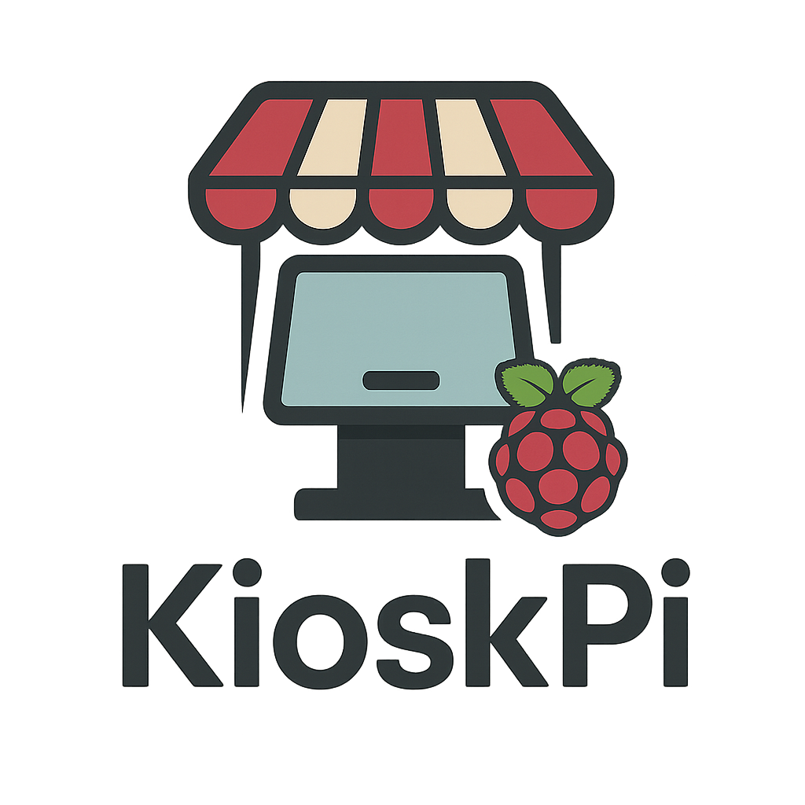

<br />
<div align="center">
  <a href="https://github.com/Robertsheesh/KioskPi">
    
  </a>
</div>

# pi-kiosk

Chromium kiosk for Raspberry Pi OS Desktop/Lite.
- Fullscreen Chromium
- Wrapper page with 2-minute refresh
- Shift+Alt+Enter to disable kiosk until reboot
- Nightly reboot at 03:00

To change the URL:
- Edit ~/kiosk.html "const URL_TO_LOAD = "https://your_url.com/display1";"

## Install
```bash
sudo apt update && sudo apt install -y git
git clone https://github.com/<you>/pi-kiosk.git
cd pi-kiosk
sudo ./install.sh
